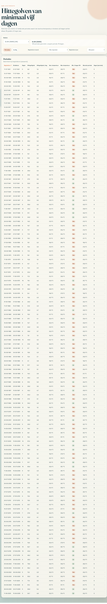
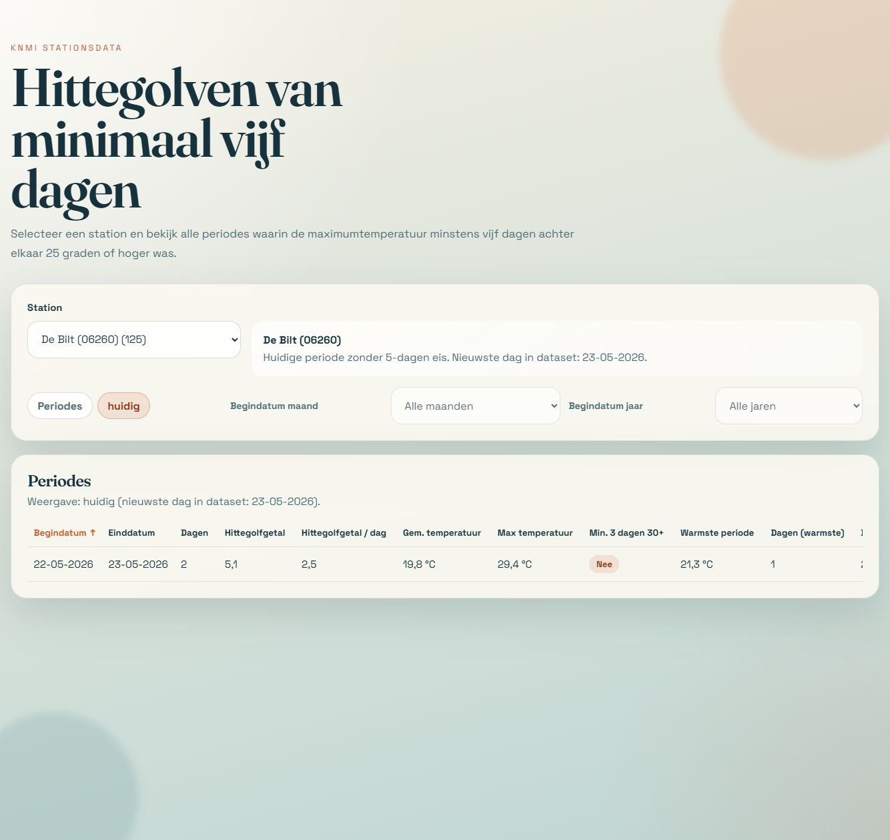

# Hittegolven per KNMI-station

Deze repository analyseert KNMI-daggegevens per station en toont hitteperiodes in een interactieve webpagina.

## Wat doet dit project?

Het project:

1. leest stationsbestanden uit `stationsdata/`;
2. bepaalt per station hitteperiodes (aaneengesloten dagen met `TX >= 25.0 °C`);
3. berekent per periode statistieken zoals hittegolfgetal, gemiddelde temperatuur en warmste subperiode;
4. genereert een browservriendelijk databestand;
5. toont alles in een sorteerbare webinterface met filters.

## Structuur

- `download_station_data.py`: downloadt en pakt KNMI-stationsbestanden uit naar `stationsdata/`.
- `generate_heatwave_data.py`: verwerkt de ruwe data en schrijft `heatwaves-data.js`.
- `heatwaves-data.js`: gegenereerde dataset voor de frontend (`window.HEATWAVE_DATA`).
- `index.html`: hoofdpagina.
- `app.js`: frontendlogica (selectie, sorteren, filters, modi).
- `styles.css`: styling.
- `docs/`: screenshots voor documentatie.
- `stationsdata/`: KNMI-bronbestanden (`etmgeg_*.txt`).

## Berekeningen

In de KNMI-data staan temperaturen in tienden van graden. Het script rekent dit om naar graden Celsius.

## Hittegolfgetal en databron

Het hittegolfgetal in deze repo is gedefinieerd als de som van `(TX - 25)` over alle aaneengesloten dagen binnen een gevonden periode waarvoor `TX > 25`. Hierbij is `TX` de dagelijkse maximumtemperatuur in graden Celsius.

De brondata komt van het KNMI (daggegevens per station). De bestanden worden opgehaald via `download_station_data.py` vanaf de KNMI downloadlocatie en opgeslagen in `stationsdata/` als `etmgeg_*.txt`.

Directe downloadbasis (KNMI): https://cdn.knmi.nl/knmi/map/page/klimatologie/gegevens/daggegevens/

Per periode worden o.a. deze velden bepaald:

- `startDate`, `endDate`, `dayCount`
- `heatwaveScore`: som van `(TX - 25)` over alle dagen in de periode
- `heatwaveScorePerDay`: hittegolfgetal gedeeld door `dayCount`
- `averageTemperature`: gemiddelde van `TG`
- `maxTemperature`: hoogste `TX`
- `hasThreeThirtyPlusDays`: minimaal 3 dagen met `TX >= 30`
- `warmestPeriodAvgTemp`, `warmestPeriodStartDate`, `warmestPeriodEndDate`, `warmestPeriodDayCount`

Daarnaast wordt per station ook bepaald:

- `currentPeriod`: huidige aaneengesloten periode aan het einde van de reeks met `TX >= 25` (zonder minimale lengte-eis)
- `latestDate`: nieuwste datum in de dataset

## Webinterface

De pagina biedt:

- stationselectie (inclusief "Alle stations");
- sorteren op alle kolommen;
- maand- en jaarfilter op basis van begindatum (in modus `Periodes`);
- twee modi:
  - `Periodes`: historische periodelijst met minimumlengte 5;
  - `huidig`: dezelfde tabelstructuur, maar met de huidige periode zonder 5-dagen-eis.

In `huidig` wordt ook expliciet de nieuwste dag in de dataset getoond.

## Gebruik

## 1) (Optioneel) data opnieuw downloaden

```bash
python download_station_data.py
```

## 2) dataset genereren voor de frontend

```bash
python generate_heatwave_data.py
```

## 3) webpagina openen

Open `index.html` in de browser.

## Vereisten

- Python 3.10+
- Voor downloaden: package `requests`

Installeren:

```bash
pip install requests
```

## Opmerkingen

- De frontend gebruikt een statisch databestand (`heatwaves-data.js`); draai daarom `generate_heatwave_data.py` opnieuw na wijzigingen in `stationsdata/`.
- KNMI waarschuwt dat sommige stationsreeksen inhomogeen kunnen zijn door wijzigingen in stationslocatie of meetmethoden.

## Voorbeeldweergaven

- `Periodes`: volledige historische lijst met maand/jaar-filter op basis van begindatum.
- `huidig`: dezelfde tabelstructuur, maar voor de huidige aaneengesloten periode aan het einde van de reeks (zonder minimale 5-dagen-eis).
- `Alle stations`: gecombineerde lijst met extra kolom voor stationsnaam.

### Periodes (voorbeeld)



### Huidig (voorbeeld)



## FAQ

### Waarom zie ik na een codewijziging nog oude data in de browser?

Omdat de frontend leest uit `heatwaves-data.js`. Draai opnieuw:

```bash
python generate_heatwave_data.py
```

### Waarom heeft een station in `huidig` soms geen rij?

Dan voldoet de nieuwste aaneengesloten reeks aan het eind van de dataset niet aan `TX >= 25` op de laatste dag.

### Hoe worden maand en jaar gefilterd?

De filters gebruiken de `startDate` van de periode.

### Waar komt de stationsnaam met code vandaan?

Die wordt opgebouwd als `Stationsnaam (06 + stationsnummer)`, bijvoorbeeld `De Bilt (06260)`.